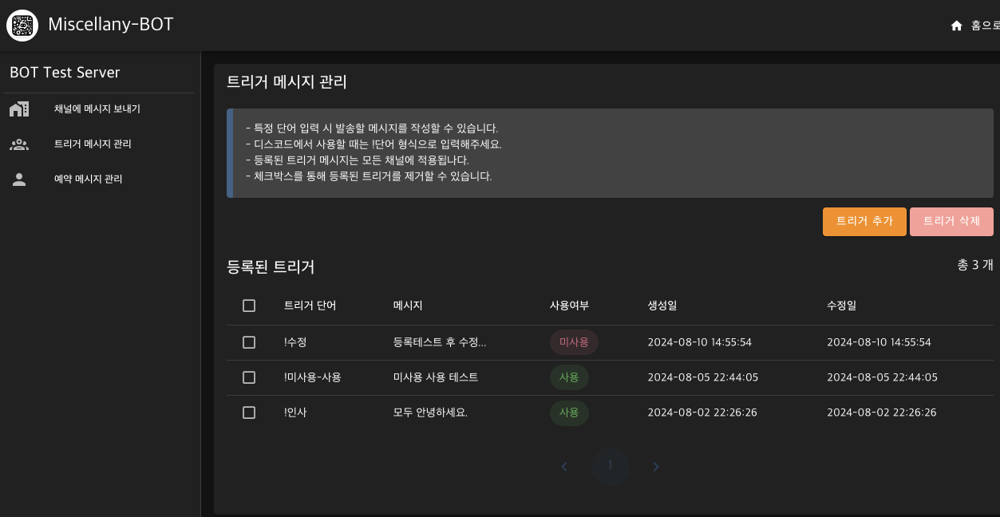
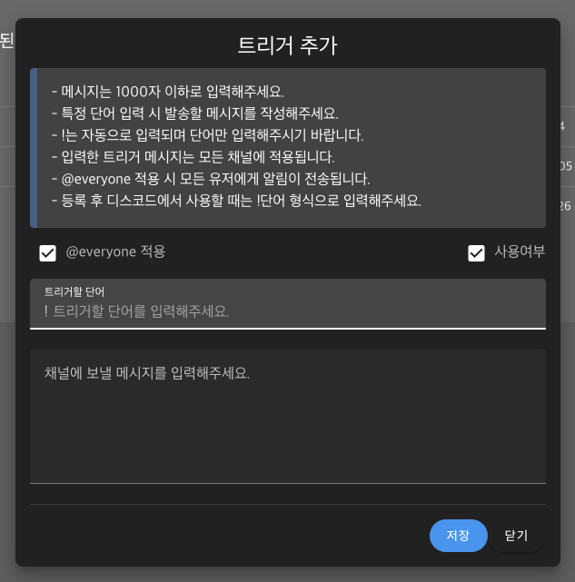

# MiscellanyBOT

최근 하고 있는 게임이 외국인들과 같이 게임을 하고 있고 소통을 위해 디스코드 채널을 개설했다.  
게임에선 제공되는 언어 번역 기능이 디스코드에는 없다보니 만들어져 있는 디스코드 봇들을 몇 가지 사용해봤는데, 무료로 제공하는 봇들은 기능 제한들이 많았다.  
번역 퀄리티가 좋지 않거나, 무료로 사용할 수 있는 횟수 제한이 있는 등 불편함이 컸다.
그리고 특정 메시지 트리거 기능이나 메시지 예약 기능등이 필요했는데  
이것 또한 무료로는 제한이 있는게 대부분이 여서 원하는 걸 찾기가 쉽지 않았다.  
그래서 직접 한 번 만들어보고자 시작했다.

## 구현 기능

1. 디스코드 로그인
2. 디스코드 봇 추가 기능
3. 추가된 봇으로 사용할 수 있는 기능

- 언어 번역 기능(Google Translate)
- 채널로 메시지 보내기 기능
  - supabase에 보낸 메시지 히스토리 저장
- 메시지 트리거 기능
  - supabase에 트리거 단어 저장해서 사용
- 예약 메시지 기능
  - supabase에 예약 메시지를 저장해서 사용

# 기술 스택

- NodeJS [21.6.1]

## Front-End

- NuxtJS [3.10.3]
- Vuetify3 [3.5.13]
- pinia [2.1.7]

## Back-End

- NestJS [10.3.2]
- Discord.js [14.14.1]
- @supabase/supabase-js [2.42.0]

# 참고 URL

1. Discord.js
   - https://discordjs.guide/
   - https://discord.js.org/docs/packages/discord.js/14.14.1
2. 디스코드 공식문서
   - https://discord.com/developers/docs/intro
   - OAuth2
     - https://discord.com/developers/docs/topics/oauth2
     - OAuth2 허용 범위
     - https://discord.com/developers/docs/topics/oauth2#shared-resources-oauth2-scopes
     - CSRF 공격 방지에 대한 내용
       - https://discord.com/developers/docs/topics/oauth2#state-and-security
3. Google Cloud
   - https://console.cloud.google.com/apis/dashboard?hl=ko
   1. Google Translate
      - https://cloud.google.com/translate/docs/setup?hl=ko
      - v2 버전과 v3 비교 설명 (https://cloud.google.com/translate/docs/editions?hl=ko)
        - 디스코드 채팅 내용을 번역할 예정이기 때문에 v2를 선택함
4. NuxtJS
   - https://nuxt.com/docs/getting-started/introduction
   - Proxy 관련(Nitro RouteRules)
     - https://nitro.unjs.io/config#routerules
     - https://jongmin4943.tistory.com/entry/Nuxt3-proxy-%EC%84%A4%EC%A0%95%ED%95%98%EA%B8%B0feat-Spring-API-%EC%84%9C%EB%B2%84
5. supabase
   - https://supabase.com/docs
   - https://supabase.com/docs/guides/api
6. Vuetify3
   - https://vuetifyjs.com/en/
   - color
     - https://vuetifyjs.com/en/styles/colors/#material-colors
   - sheet
     - https://vuetifyjs.com/en/components/sheets/#usage
7. pinia
   - https://pinia.vuejs.org/
8. NestJS
   - dynamic cron jobs
     - https://docs.nestjs.com/techniques/task-scheduling#dynamic-cron-jobs
   - Caching
     - https://docs.nestjs.com/techniques/caching
9. ETC
   - https://stackoverflow.com/questions/69501363/discord-api-view-guild-channels-information-with-oauth2-guilds-scope

# 구현 화면

## 비로그인 상태 최초 접속


## 로그인


디스코드에서 제공하는 OAuth2 로그인 화면

### 승인 후 인증 화면


승인 후 인증 페이지에서 토큰 발급 처리 로직을 진행하는 동안의 화면

#### 인증 실패 시


인증 실패시 출력되는 화면, 다시 로그인하기를 누르면 로그인 페이지로 이동됨

#### 인증 성공 시


이 화면이 출력되고 잠히 수 메인 화면으로 이동됨

## 메인 화면


현재 내가 관리중인 서버 리스트를 보여준다.(로그인한 디스코드 계정 기준)   
봇이 추가되어 있는지 여부를 보여주고, 추가되어 있으면 [관리] 버튼을, 추가되어 있지 않으면 [봇 추가] 버튼이 활성화 된다.   
봇 추가 버튼을 누르면 설치 페이지로 이동

### [봇 추가] 클릭 시


서버에 봇을 추가할 수 있다.

## 채팅 번역 기능

Google Translate API를 이용해 구현했다.


번역하고자 하는 채팅 메시지를 우클릭 해서 [앱] 메뉴를 열면 번역할 수 있는 메뉴가 나온다.   
5개만 넣을 수 있어서, 같이 게임하는 외국인들의 나라를 선정해서 선택했다.   
선택하면 번역 대상 언어가 어느 국가인지 자동으로 판별해서 번역해 준다.


"안녕하세요."를 [Translate to English]를 선택해서 번역된 모습이다.

## 관리페이지 메인


메인 화면에서 [관리] 버튼을 눌렀을 때 보여지는 페이지로 간단한 기능 설명을 확인할 수 있다.

## 채널에 메시지 보내기


채널을 선택해서 메시지를 전송할 수 있고, 보낸 메시지에 대한 히스토리를 저장하고 있다.

채널은 텍스트 채널만 노출되며, 선택해서 메시지를 전송할 수 있다.

## 트리거 메시지 관리

등록한 트리거는 supabase database에 저장된다.  
애플리케이션이 실행되면 데이터베이스에서 가져와서 애플리케이션 내부에 저장한다.  
등록, 수정, 삭제 시에 최신화 시킨다.  
디스코드 메시지가 입력될때마다 체크해서 있으면 전송한다.


특정 단어에 메시지 트리거를 설정하는 페이지.

트리거 추가 다이얼로그

등록된 트리거 단어를 디스코드 채팅에 입력했을 때 메시지가 전송된 모습

## 예약 메시지 관리

@nestjs/schedule 패키지를 이용했다.  
틍록한 예약 메시지는 supabase database에 저장한다.  
애플리케이션이 실행되면 데이터베이스에서 가져와서 크론잡을 등록한다.  
1회성 메시지는 발송 시간을 넣고, 반복 메시지는 크론시간을 계산해서 반복적으로 등록할 수 있게 한다.

```typescript
// 반복 메시지 크론잡 시간 설정
  private makeCronTime(
    date: Date,
    repeatInterval: number,
    repeatType: RepeatType,
  ) {
    const d = dayjs(date);
    if (repeatType === 'DAY') {
      return `0 ${d.minute()} ${d.hour()} * * *`;
    } else if (repeatType === 'HOUR') {
      return `0 ${d.minute()} * * * *`;
    } else if (repeatType === 'MINUTE') {
      return `${d.minute()}/${repeatInterval} ${d.hour()}-23 * * *`;
    }
  }
```


특정 메시지를 정해진 시간에 1회 전송 또는 일정 주기마다 메시지를 반복적으로 보낼 수있는 페이지

### 1회성 메시지 등록 다이얼로그


메시지를 전송할 채널을 선택 후 전송할 메시지를 입력 할 수 있다.   
그리고 전송될 시간을 설정.


등록된 1회성 메시지가 전송된 모습

### 반복 전송 등록 다이얼로그


반복 메시지 등록 다이얼로그

반복 주기 단위는 분, 시간, 일 3가지로 제공된다.

등록된 메시지가 반복적으로 전송되는 모습
